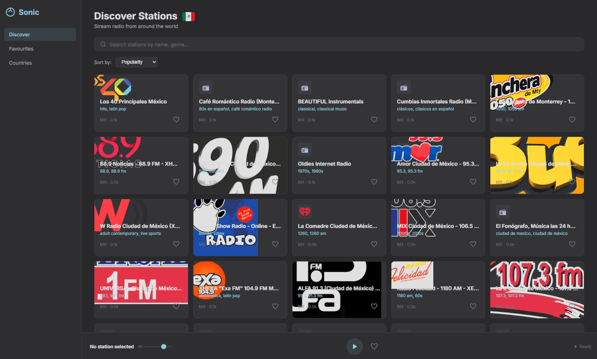
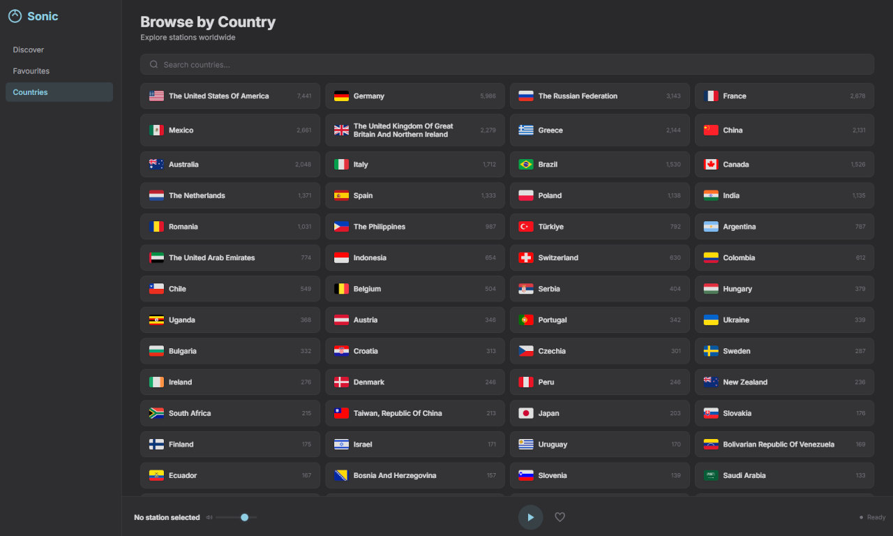

# SonicFM — Radio Streaming App

A modern, dark-themed web application for discovering and streaming internet radio stations worldwide. Powered by the [Radio Browser API](https://www.radiobrowser.info/).




## Features

- **Discover Stations** — Browse thousands of live radio stations sorted by popularity, name, or click count.
- **Search** — Find stations by name, genre, or tag.
- **Browse by Country** — Explore stations filtered by country with flag icons. A country flag appears next to the "Discover Stations" header when a country is selected.
- **Favourites** — Save your favourite stations locally for quick access.
- **Live Audio Player** — Play/pause streaming, adjust volume, and monitor connection status.
- **Responsive Design** — Works on desktop and mobile with a collapsible sidebar layout.
- **Dark Theme** — Charcoal surfaces with sky-blue accents and a plexus particle background.

## Tech Stack

| Layer | Technology |
|-------|------------|
| Frontend | Vanilla HTML, CSS, JavaScript |
| API | [Radio Browser API](https://www.radiobrowser.info/) (`de1.api.radio-browser.info`) |
| Storage | `localStorage` for favourites |
| Fonts | Inter (body), JetBrains Mono (mono) |

## Getting Started

### Prerequisites

- A modern web browser (Chrome, Firefox, Edge, Safari)
- A local web server (optional — see below)

### Run Locally

1. Clone the repository:
   ```bash
   git clone https://github.com/<your-username>/SonicFM.git
   cd SonicFM
   ```

2. Open `index.html` in your browser, or serve it locally:
   ```bash
   # Python
   python3 -m http.server 8080

   # Node
   npx serve .

   # PHP
   php -S localhost:8080
   ```

3. Navigate to `http://localhost:8080` (or the port shown).

> **Note:** Some browsers block local file requests for CORS. Using a local server is recommended.

## Project Structure

```
SonicFM/
├── index.html      # Main HTML structure
├── style.css       # Dark theme styles, layout, animations
├── script.js       # App logic: API calls, rendering, player, state
├── images/
│   └── flags/      # Country flag PNGs
└── README.md
```

## How It Works

### Station Discovery

Stations are fetched from the Radio Browser API with pagination (36 per page). Results are deduplicated by normalized station name to avoid duplicates from multiple UUIDs.

### Country Filtering

Clicking a country card switches to the Discover view and filters stations by the country's ISO 3166-1 code. The country flag appears next to the "Discover Stations" header.

### Favourites

Favourite stations are stored in `localStorage` as JSON objects containing the station UUID, name, URL, country code, and favicon. They persist across sessions.

### Audio Player

The built-in `<audio>` element streams the station's URL directly. 

## API Reference

The app uses the Radio Browser API (v1 JSON):

| Endpoint | Purpose |
|----------|---------|
| `GET /stations/search` | Search/filter stations |
| `GET /countries` | List all countries with station counts |

### Station Search Parameters

| Parameter | Description |
|-----------|-------------|
| `limit` | Number of results (max 500) |
| `offset` | Pagination offset |
| `order` | Sort field: `votes`, `name`, `clickcount` |
| `countrycode` | ISO 3166-1 alpha-2 country code |
| `name` | Search term for station name |
| `reverse` | `true` — newest first |

## Customization

### Theme Colors

Edit CSS custom properties in `style.css` under `:root`:

```css
:root {
  --accent: #86C1D5;        /* Sky blue accent */
  --surface-0: #18181A;     /* Background */
  --surface-1: #1E1E21;     /* Sidebar */
  --surface-2: #262629;     /* Cards */
  --text-primary: #E8E8EC;  /* Body text */
  --text-secondary: #A0A0A6;/* Muted text */
}
```

### Flag Images

Country flags are stored in `images/flags/`. The `getFlagImage()` function in `script.js` maps API country names to flag filenames. Add new mappings to the `FLAG_MAP` object for unmapped countries.

## Browser Support

- Chrome 90+
- Firefox 88+
- Edge 90+
- Safari 14+

## Development Note

This project was developed using **vibe coding**—an iterative, high-level conceptual development approach where the developer guides the "vibe" and intent while the AI handles the heavy lifting of implementation.

> **Built with the help of:** Qwen3.6-35b-a3b model.

## 📄 License

Distributed under the MIT License. Read [LICENSE](LICENSE) here 
